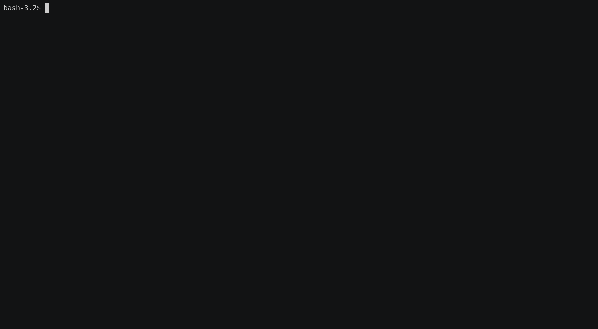

fail2ban-watcher
===========

[](https://travis-ci.org/romibuzi/fail2ban-watcher)

### Demo



### Requirements

Java8 or newer and recent version of [maven](https://maven.apache.org/) (> 3.5.4)

### Tests

```
mvn test
```

### Package

```
mvn package
```

### Run

```
java -jar target/fail2ban-watcher.jar
```

By default it will try to analyze `/var/lib/fail2ban/fail2ban.sqlite3`.
This can be configured with `FAIL2BAN_DB` environment variable :

```
FAIL2BAN_DB=/custom/path/to/fail2ban.sqlite3 java -jar target/fail2ban-watcher.jar
```

### Credits

This project includes IP2Location LITE data available from http://www.ip2location.com
